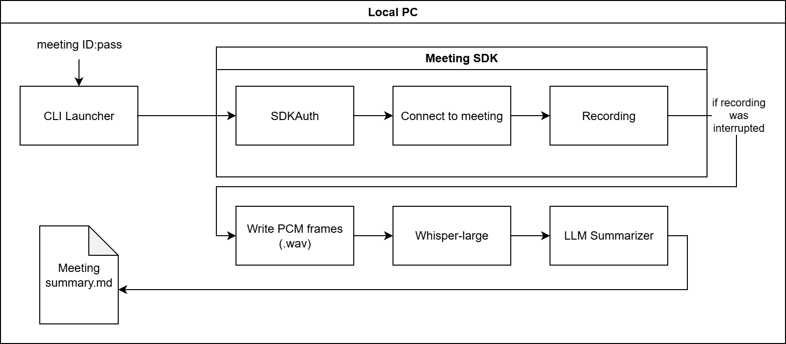

# MyPrivateRecorder – Technical Design (TD)

**Version** 1.0  **Date** 20 July 2025

## 1. Overview
CLI utility that joins a Zoom meeting via the Linux Meeting SDK,
captures the mixed audio stream, writes a local WAV file, and exits.

## 2. Architecture Diagram

## 3. Data Flow
1. User runs `sample_program/sample.py -m "<ID>:<pwd>"`.
2. SDKAuth ➜ Join Meeting (SDK_UT_WITHOUT_LOGIN + ZAK).
3. Audio helper delivers PCM frames (32 kHz, mono).
4. Frames streamed to `wave.open()` → `*.wav` on local disk.
5. File handle is closed on `MEETING_STATUS_ENDED`.

_No data leaves the user’s computer._

## 4. Permissions & SDK Scopes
| Category | Detail |
|----------|--------|
| Meeting SDK | Raw Audio (one‑way) – required to record. |
| OAuth Scopes | None (uses ZAK). |
| Webhooks | None. |

## 5. Security Controls
* Runs under user account, no elevated privileges.  
* No inbound ports opened.  
* Dependency updates via `pip‑tools` + Dependabot.  
* SAST (Bandit + Semgrep) on every push – see [SAST_Bandit.json](./SAST_Bandit.json).  

## 6. Error Handling / Logs
Errors printed to `stderr`, no sensitive data logged.

## 7. Deployment / Update
Distributed as source + `requirements.txt`; no auto‑update.
